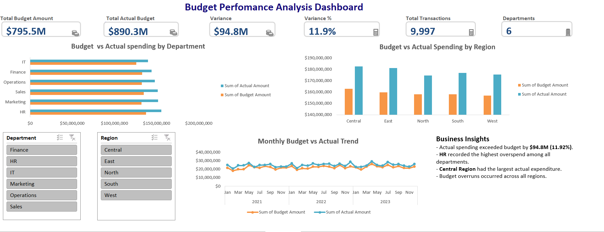

# Budget vs Actual Performnace Dashboard

## Project Overview 

This project is an interactive Budget vs Actual Performance Dashboard developed in Microsoft Excel. The dashboard compares budgeted and actual spending across departments, regions, and time periods, enabling users monitor financial performance, identity budget variances, and support data-driven decison making through interactive visualizations.

--- 

## Project Objectives

- Compare budgeted and actual spending.
- Analyse spending performance across departments and regions.
- Identify budget variances and overspending trends.
- Monitor monthly spending performance.
- Present key business insights using interactive visualisations.

---
## Tools & Skills Used
- Microsoft Excel
- Pivot Tables
- Pivot Charts
- Slicers
- KPI Cards
- Custom Number Formatting
- Conditional Formatting
- Data Visualization
- Dashboard Design
- Business Analysis

---

## Dashboard Features

### Executive KPIs
- Total Budget
- Total Actual Spending
- Budget Variance
- Variance Percentage
- Number of Transactions
- Number of Departments

### Interactive Filters
- Department
- Region

### Visualizations
- Budget vs Actual Spending by Department
- Budget vs Actual Spending by Region
- Monthly Budget vs Actual Spending Trend

### Business Insights
The dashboard provides a summary of the major spending trends and highlights areas of budget overspend.

---

## Key Insights

- Actual spending exceeded the allocated budget by **$94.8M**, representing an **11.9%** budget variance.
- The HR department recorded the highest overspending.
- The central region recorded the highest actual expenditure.
- All regiosn exceeded their allocated budgets, highlighting opportunities for improved budget monitoring and cost control.

---

## Dataset
The data used for this project is included within the excel workbook. The workbook contains seperate worksheets for:

- **Raw Data:** Original financial dataset before cleaning.
- **Cleaned Data:** Data prepared through cleaningand formatting for analysis.
- **Dashboard:** Interactive dashboard built usingPivot Tables, Pivot Charts, KPI cards, and Slicers.

## Data Preparation

The dataset was cleaned and prepared in Microsoft Excel before analysis.

- Removed duplicate records.
- Standardized date formats.
- Corrected inconsistent data entries.
- Converted the dataset intol Excel Table.
- Verified data accuracy before analysis.

## Dashboard Preview

---

## Files Included

- Budget_vs_Actual_Dashboard.xlsx
   - Raw Data
   - Cleaned Data
   - Dashboard
- Budget_vs_Actual_Dashboard.png
- README.md

---

## Skills Demonstrated

- Financial Data Analysis
- Dashboard Development
- KPI Reporting
- Data Aggregation
- Data Visualization
- Interactive Reporting
- Business Insight Generation
- Microsoft Excel

---

## Business Value
This dashboard enables stakeholders to evaluate budget performance, monitor spending  trends, identify areas of overspending, and make informed financial decisions through interactive reporting.

---

## Author
**Fatima Idiaghe**
