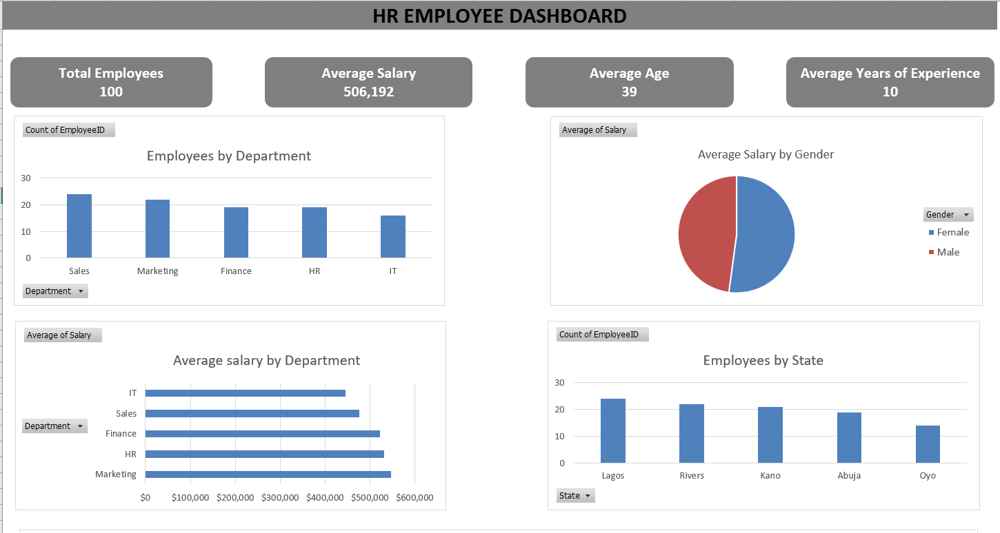
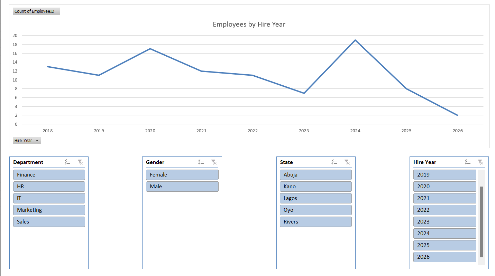

# HR Employess Salary Dashboard

##   Project Overview

This project is an interactive HR Employee Salary Dashboard built in Microsoft Excel. It provides insights into employee salaries, workforce demorgraphics, departmental distribution, experience levels, and performance ratings. The dashboard helps HR professionals and business managers make data -driven decisions regarding compensation and workforce planning.

---

## Business Problem

Organizations need to understand workforce trends to improve employee compensation and resources allocation. This dashboard answers questions such as:

- Which departments have the highest salary expenses?
- How are salaries distributed across departments?
- Does experience influence employee salary?
- What is the gender distribution across the workforce?
- How are employess performing across departments?

---

## Dataset

The dataset includes:

- Employee ID
- Full Name
- Gender
- Age
- Department
- Job Title
- Salary
- Salary Band
- Years of Experience
- Experience level
- Performance Rating
- State
- Hire Date
- Hire Year

---

## Tools Used
- Microsoft Excel
- Pivot Tables
- Pivot Charts
- Slicers
- Conditional Formatting
- Excel Dashboard

---

## Data Cleaning

The data preparation process included:

- Removing duplicate records
- Checking for missing values
- Standardizing column names
- Formatting dates
- Validating salary values
- Preparing data for Pivot Tables

--- 

## Dashboard Features

The dashboard includes:

- Salary Overview
- Employee Distribution by Department
- Salary by Experience Level
- Performance Rating Analysis
- Gender Distribution
- Interactive Slicers for filtering

---

## Key Insights

- Salary varies across departments and job roles.
- Employees with more experience generally earn higher salaries.
- Departmental salary comparisons help identify compensation trends.
- Interactive slicers allow users to explore workforces data dynamically.

---
## Skills Demonstrated

- Data Cleaning
- Data Analysis
- Dashboard Design
- Pivot Tables
- Pivot Charts
- Data Visualization
- HR Analytics
- Microsoft Excel

---

## Dashboard Preview

### Overview

### Details

---

## Files Included

- HR_Employee_Dashboard.xlsx
- HR_Employee_Dasboard.png
- README.md

---

## Author

**Fatima Idiaghe**

