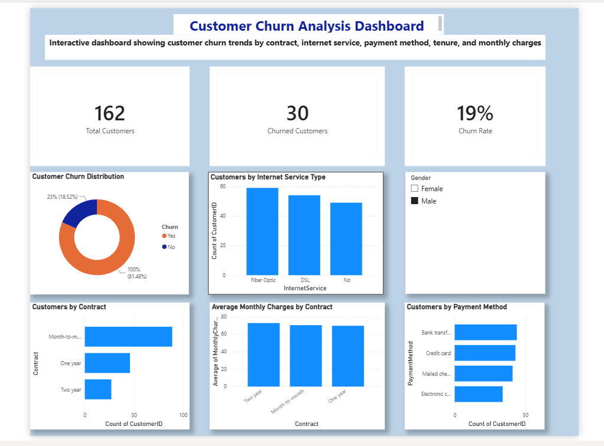

# Customer Churn Analysis Dashboard

## Project Overview

This project is an interactive Power BI dashboard designed to analyze customer churn and identify trends that can help businesses improve customer retention. The dashboard provides key insights into customer behaviour through interactive visualizations and KPIs.

## Tools Used

- Microsoft Power BI
- Power Query
- DAX (Data Analysis Expressions)

## Key Features

- Interactive KPI cards
- Customer Churn Analysis
- Customer Segmentation
- Dynamic Slicers
- Data Visualization
- Business Intelligence Dashboard

## Skills Demonstrated

- Data Cleaning
- Data Transformation
- Data Visualization
- Dashboard Development
- DAX
- Power Query
- Business Intelligence
- KPI Reporting

## Files Included

- Customer_Churn_Dashboard
- Customer_Churn_Dashboard.png
- README.md

## Dashboard Preview

## Author
**Idiaghe Fatima**
