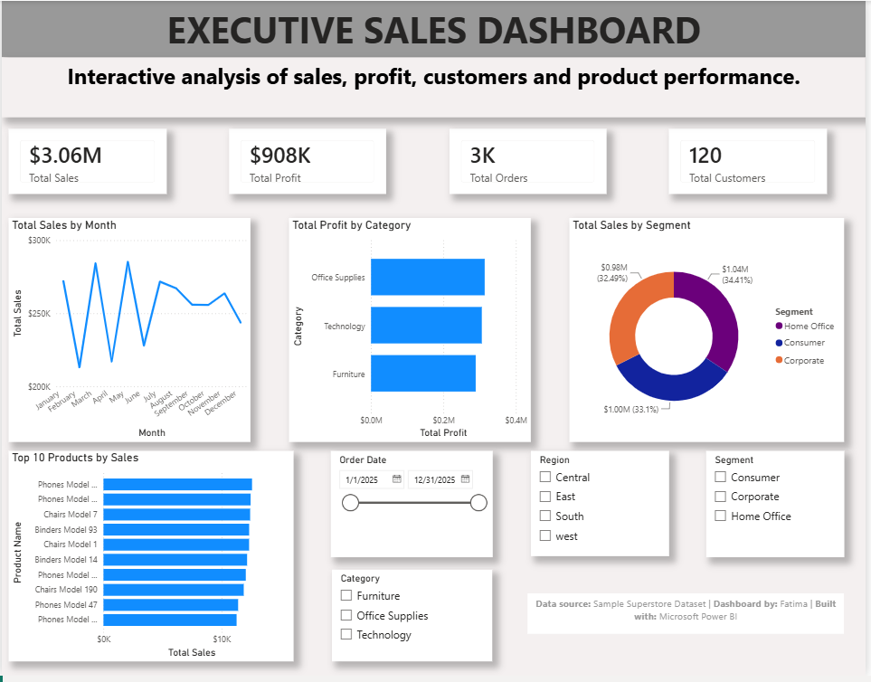

# Executive Sales Dashboard

## Project Overview

This project is an interactive Executive Sales Dashboard built in Microsoft Power BI using the Sample Superstore dataset. The dashboard provides a high level overview of business performance by analyzing sales, profit, customers, and product performance.

The goal is to help business stakeholders monitor key performance indicatore (KPIs), identify sales trends, and make data-driven decisions through interactive visualizations.

---

## Dashboard Preview

---

## Dataset

**Source:** Sample Superstore Dataset

The dataset contains information on:
- Orders
- Sales
- Profit
- Customers
- Products
- Categories
- Regions
- Order Dates
- Shipping Details
---

## Tools Used

- Microsoft Power BI
- Power Query
- DAX (Data Analysis Expressions)

---

## Dashboard Features

- Monthly Sales Trend
- Profit by Category
- Sales by Customer Segment
- Top 10 Product by Sales
- Interactive Date Filter
- Region Filter
- Category Filter
- Segment Filter

---

## Key Insights

- Total Sales reached **$3.06M**.
- Total Profit amounted to **$908k**.
- The dashboard tracks **2,963** orders across **120** customers.
- Sales performance can be explored by region, category, segment, and time period using interavtive slicers.

---

## Skills Demonstrated

- Data Cleaning
- Data Modeling
- DAX Measures
- Data Visualization
- Interactive Dashboard Design
- Business Intelligence
- KPI Reporting

---

## Files Included

- Executive_Sales_Dashboard.pbix
- Executive_Sales_Dashboard.png
- Sample_superstore.xlsx
- README.md

---

## Author

**Fatima**

Aspiring Data Analyst passionate about transforming data into actionable insights using Excel, SQL, Power BI, and Python.
