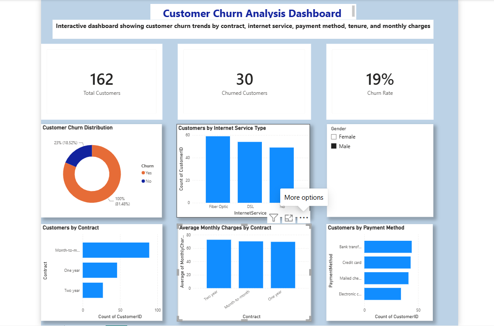

# Customer Churn Analysis Dashboard

## Project Overview

This project analyzes customer churn data using Power BI. The dashboard helps identify customer churn patterns by examining contract types, internet services, payment methods, and monthly charges.

## Dashboard Preview

## Tools Used

- Power BI
- DAX
- Data Visualization

## Key Metrics

- Total Customers
- Churned Customers
- Churn Rate

## Dashboard Features

- Customer Churn Distribution
- Customers by Internet Service Type
- Customers by Contract
- Average Monthly Charges by Contract
- Customers by Payment Method
- Gender Slicer for interactive filtering

## Key Insights

- Customers on month-to-month contracts have the highest churn.
- Fiber optic internet users make up a large portion of the customer base.
- The dashboard provides an interactive view of customer behaviour using filters and KPIs.
- Churn rate is displayed as a KPI for quick business monitoring.

## Skills Demonstrated

- Data Modeling
- DAX Measures
- KPI Creation
- Interactive Dashboard Design
- Data Visualization
- Business Intelligence Reporting
