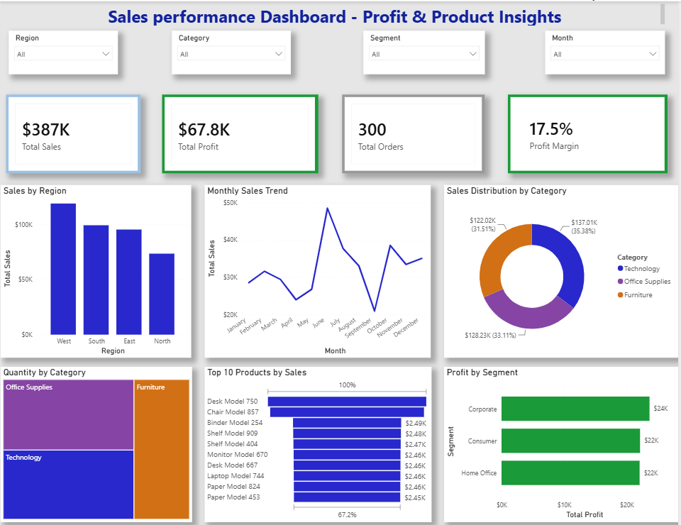
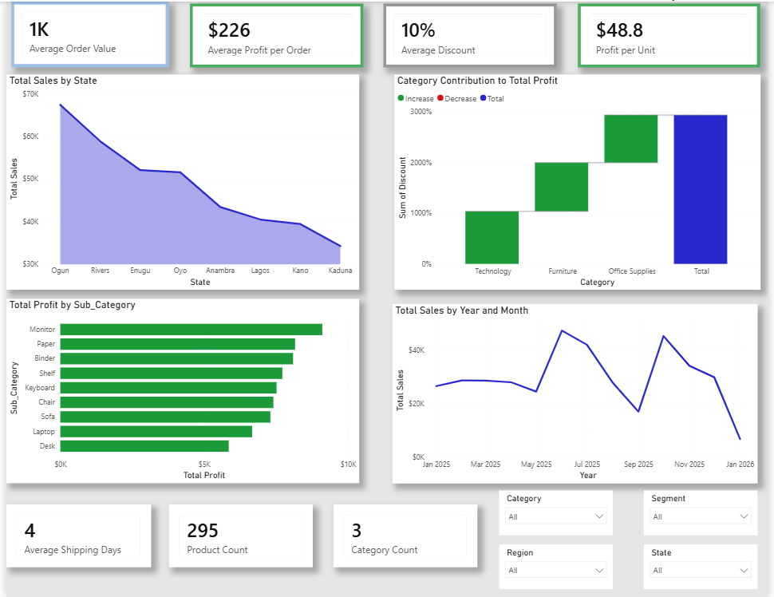

# Sales Performance Dashboard | Power BI

## Project Overview

This project is an interactive Power BI dashboard developed to analyze sales performance acrossregions, product categories, customer segments, and time periods. The dashboard provides business insights through KPI cards, trend analysis, and interactive visualizations to support data-driven decision-making.

---

## Objectives

- Analyze overall sales performance.
- Monitor profitability and profit margin.
- Track monthly sales trends.
- Identify top-performing products.
- Compare sales across different regions.
- Analyze sales distribution by product category.
- Evaluate customer segment profitability.

---

## Tools & Technologies

- Power BI Desktop
- Power Query
- DAX (Data Analysis Expressions)
- Microsoft Excel

---

## Dataset

The datset contians retail sales transaction data, including:

- Order Date
- Region
- State
- Product Name
- Category
- Segment
- Sales
- Profit
- Quantity
- Discount

---

## Dashboard Features

### Page 1 - Sales Overview

- Total Sales KPI
- Total Proft KPI
- Total Orders KPI
- Profit Margin KPI
- Sales by Region
- Monthly Sales Trend
- Sales Distribution by Category
- Quantity by Category
- Top 10 Products by Sales
- Profit by Segment
- Interactive Slicers

---

### Page 2 - Product & Profit Analysis

- Average Oredr Value
- Average Profit per Order
- Average Discount
- Profit per Unit
- Total Sales by State
- Total Profit by Sub-Category
- Monthly Sales Trend
- Profit Contribution by Category
- Interactive Slicers

---

## DAX Measures

The following DAX measures were created:

- Total Sales
- Total Profit
- Total Orders
- Profit Margin
- Average Profit per Order
- Profit per Unit
- Product Count
- Category Count

---

## Key Insights

- West Region recorded the highest sales.
- Technology generated the highest sales contribution.
- Corporate customers generated the highest profit.
- Desk Model 750 was the top-selling product.
- Average shipping time was 4 days.

---

## Dashboard Preview

### Page 1

### Page 2

## Skills Demonstrated

- Data Cleaning
- Data Transformation
- Data Modeling
- DAX calculations
- KPI Development
- Interactive Dashboard Design
- Data Visualization
- Business Intelligence
- Business Insights

---

## Author
**Fatima Idiaghe**

